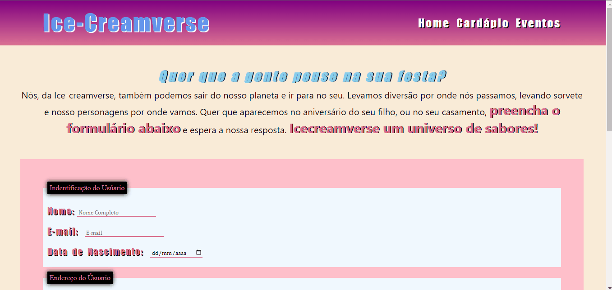

<h1>ICE-CREAMVERSE (SITE TREINO)</h1>

<h2>SOBRE</h2>

O site da "Ice-creamverse", uma sorveteria ficticia, é o meu o primeiro site que fiz sozinho. Após alguns estudos por conta própria, decide colocar meu conhecimento em prática. Inspirado em um prjeto da faculdade para a matéria de Programação Web, cujo trabalho também consistia em fazer o site para um sorveteria, criei o ICE-CREAMVERSE.

O Projeto consiste em 3 página: a Inicial, a de Cádapios e a de Eventos. Toda a programação foi feita usando apenas <strong>HTML e CSS</strong>, pretendo refazer esse proejeto em breve e integrar JavaScript e PHP.

<h2>HOME</h2>

<h2>CÁRDAPIO</h2>

<h2>EVENTOS</h2>

